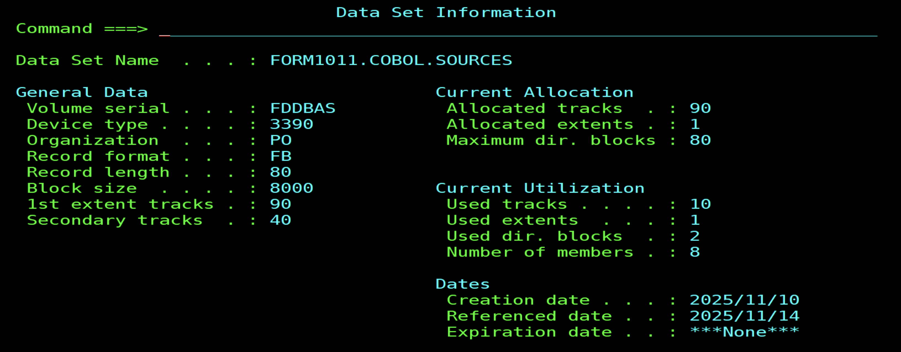

# Résumé simportant

---

## Les variables

### 🧩 1. Définition générale

En **COBOL**, une variable est définie dans la **DATA DIVISION**, généralement dans la section **WORKING-STORAGE SECTION**.
Chaque variable est décrite avec :

* **Un niveau hiérarchique (niveau 01, 05, 10...)**
* **Un nom de variable (data name)**
* **Un type (PIC / Picture clause)**, qui définit la forme, la longueur et le type de donnée (numérique, alphabétique, etc.)

---

### 🔠 2. Les principaux types de variables

#### a) **Alphanumériques (A ou X)**

* Contiennent des **caractères alphabétiques, numériques ou spéciaux**.
* Utilisées pour du **texte** (noms, messages, etc.)

**Exemple :**

```cobol
01  NOM-PRENOM     PIC X(30).
```

➡️ 30 caractères, n’importe quel symbole ASCII.

---

#### b) **Alphabétiques (A)**

* Contiennent **seulement des lettres (A–Z)** et espaces.
* Peu utilisées aujourd’hui (souvent remplacées par `X`).

**Exemple :**

```cobol
01  NOM            PIC A(10).
```

---

#### c) **Numériques (9)**

* Contiennent uniquement des **chiffres (0–9)**.
* Utilisées pour les **calculs arithmétiques**.

**Exemple :**

```cobol
01  AGE            PIC 9(3).     *> Ex: 025
```

**Avec signe :**

```cobol
01  SOLDE          PIC S9(5).    *> S indique que la variable est signée
```

---

#### d) **Numériques à virgule (V)**

* Permet d’indiquer une **virgule implicite** (non stockée, mais comprise).
* Exemple : `PIC 9(3)V99` = 123,45

**Exemple :**

```cobol
01  MONTANT        PIC 9(5)V99.   *> ex : 12345,67
```

---

#### e) **Éditées (affichage formaté)**

* Servent à **afficher ou imprimer** des nombres avec un **format lisible** (espaces, virgules, signes...).
* Utilisent des symboles comme :

  * `Z` → espace pour les zéros inutiles
  * `,` → séparateur de milliers
  * `.` → point décimal (selon la configuration)
  * `+` ou `-` → signe explicite

**Exemple :**

```cobol
01  MONTANT-AFFICHAGE PIC ZZ,ZZ9.99.
```

➡️ Affiche `12 345,67` à la place de `12345.67`.

---

#### f) **Comp (Computational)**

* Représente des **variables binaires** (stockées en format machine, pas texte).
* Utilisées pour les **performances et calculs rapides**.

**Exemples :**

```cobol
01  TOTAL-VENTES    PIC S9(6) COMP.   *> Format binaire (2 ou 4 octets)
01  NB-CLIENTS      PIC 9(4) COMP-3.  *> Format "packed decimal"
```

#### Variantes :

* **COMP / COMP-4 / BINARY** → binaire pur
* **COMP-3** → format décimal empaqueté (stockage compact)

---

### 🧠 3. Types spéciaux

| Type              | Description          | Exemple            |
| ----------------- | -------------------- | ------------------ |
| **PIC X(n)**      | Texte libre          | `PIC X(20)`        |
| **PIC 9(n)**      | Entier positif       | `PIC 9(5)`         |
| **PIC S9(n)**     | Entier signé         | `PIC S9(5)`        |
| **PIC 9(n)V9(m)** | Nombre à virgule     | `PIC 9(4)V99`      |
| **COMP / COMP-3** | Numérique performant | `PIC S9(4) COMP-3` |
| **PIC Z(n)**      | Variable éditée      | `PIC ZZ9`          |

---

### 🧾 4. Exemple global

```cobol
WORKING-STORAGE SECTION.
01  NOM-COMPLET       PIC X(30).
01  AGE-PERSONNE      PIC 9(3).
01  SALAIRE           PIC 9(5)V99.
01  SALAIRE-FORMATE   PIC ZZ,ZZ9.99.
01  NB-EMPLOYES       PIC S9(4) COMP.
```
---


#### 🧩 **Résumé visuel – Types de variables en COBOL**

| 🏷️ **Type / PIC**          | 💡 **Contenu**                                            | 🧠 **Utilisation principale**                  | 🧮 **Exemple de définition**    | 📊 **Exemple de valeur**   |
| --------------------------- | --------------------------------------------------------- | ---------------------------------------------- | ------------------------------- | -------------------------- |
| `PIC X(n)`                  | Caractères alphanumériques (lettres, chiffres, symboles)  | Textes, messages, noms, identifiants           | `01 NOM PIC X(20).`             | `"Lionel MESSI"`        |
| `PIC A(n)`                  | Lettres uniquement (A–Z)                                  | Chaînes alphabétiques pures (rare aujourd’hui) | `01 PRENOM PIC A(10).`          | `"LISA      "`             |
| `PIC 9(n)`                  | Chiffres uniquement (0–9)                                 | Entiers positifs                               | `01 AGE PIC 9(3).`              | `025`                      |
| `PIC S9(n)`                 | Chiffres signés (S = signe + ou -)                        | Nombres pouvant être négatifs                  | `01 SOLDE PIC S9(5).`           | `+01234` ou `-00450`       |
| `PIC 9(n)V9(m)`             | Nombre à virgule implicite                                | Montants, calculs avec décimales               | `01 PRIX PIC 9(4)V99.`          | `1234,50`                  |
| `PIC Z(n)` / formats édités | Format d’affichage (masquage des zéros, virgules, signes) | Affichage de rapports ou factures              | `01 MONTANT-AFF PIC ZZ,ZZ9.99.` | `12 345,67`                |
| `PIC 9(n) COMP`             | Stockage binaire (rapide)                                 | Calculs internes performants                   | `01 TOTAL PIC 9(4) COMP.`       | (stocké en binaire)        |
| `PIC 9(n) COMP-3`           | Décimal empaqueté (packed decimal)                        | Calculs financiers précis                      | `01 SOMME PIC S9(6)V99 COMP-3.` | (stocké de façon compacte) |

---

### ⚙️ **Compléments importants**

| 🧱 Élément                  | 📘 Description                                         | 🧩 Exemple                          |
| --------------------------- | ------------------------------------------------------ | ----------------------------------- |
| **Signe (`S`)**             | Indique que la variable peut être positive ou négative | `PIC S9(4)`                         |
| **Virgule implicite (`V`)** | Position de la virgule (non stockée physiquement)      | `PIC 9(3)V99` → `123,45`            |
| **Zéro masqué (`Z`)**       | Cache les zéros à gauche à l’affichage                 | `PIC ZZ9` → `123` au lieu de `0123` |
| **COMP / COMP-3**           | Format machine, non affichable directement             | Optimise les calculs                |

---

Parfait 👍 Voici une version **complète et enrichie** du tableau récapitulatif des **types de variables en COBOL**, avec en plus :

* les **formats de variables (affichage, stockage, usage)**
* et les **types d’initialisation** 🔥

---

## 🔢 **FORMAT DE VARIABLES EN COBOL**

| 🔧 **Format**       | 💬 **Description**                                  | 💾 **Utilisation**                           | ⚡ **Exemple**             |
| ------------------- | --------------------------------------------------- | -------------------------------------------- | ------------------------- |
| **DISPLAY**         | Données visibles (texte, chiffres lisibles)         | Par défaut pour la plupart des variables     | `PIC X(20)` ou `PIC 9(4)` |
| **COMP / BINARY**   | Stockage binaire (2, 4 ou 8 octets selon la taille) | Calculs rapides, moins de mémoire            | `PIC S9(4) COMP`          |
| **COMP-3**          | Format décimal empaqueté (1 octet = 2 chiffres)     | Calculs financiers précis                    | `PIC S9(7)V99 COMP-3`     |
| **INDEX / POINTER** | Pointeurs internes utilisés dans les tables         | Parcours de tableaux, gestion mémoire        | `INDEXED BY IDX`          |
| **EDITED**          | Format d’affichage avec masques (Z, +, -)           | Pour présenter les résultats à l’utilisateur | `PIC Z,ZZZ,ZZ9.99`        |

---

## 🔰 **LES TYPES D'INITIALISATION**

| ⚙️ **Méthode**                      | 💡 **Description**                                                         | 💾 **Syntaxe COBOL**                                                    | 📊 **Exemple de résultat**    |
| ----------------------------------- | -------------------------------------------------------------------------- | ----------------------------------------------------------------------- | ----------------------------- |
| **INITIAL VALUE**                   | Valeur fixée **à la déclaration**                                          | `01 AGE PIC 9(2) VALUE 18.`                                             | AGE = `18`                    |
| **INITIALIZE**                      | Réinitialise **toutes les variables d’un groupe** à leur valeur par défaut | `INITIALIZE CLIENT.`                                                    | (remet tout à zéro ou espace) |
| **MOVE**                            | Affectation d’une valeur à l’exécution                                     | `MOVE 25 TO AGE.`                                                       | AGE = `25`                    |
| **DEFAULT VALUE (Working-Storage)** | (même effet que VALUE, utilisé pour constantes)                            | `01 TAXE VALUE 20.`                                                     | TAXE = `20`                   |
| **SPACES**                          | Initialise à des espaces (`X`)                                             | `INITIALIZE MESSAGE REPLACING NUMERIC BY ZEROS ALPHANUMERIC BY SPACES.` | `"          "`                |
| **ZEROS / ZERO / ZEROES**           | Initialise les numériques à 0                                              | `MOVE ZERO TO TOTAL.`                                                   | TOTAL = `0000`                |
| **HIGH-VALUE / LOW-VALUE**          | Valeurs limites (caractère max/min selon EBCDIC)                           | `MOVE HIGH-VALUE TO CHAMP.`                                             | CHAMP = caractère maximal     |
| **QUOTE / ALL 'x'**                 | Initialise avec un caractère spécifique                                    | `MOVE ALL '*' TO LIGNE.`                                                | LIGNE = `"**********"`        |

---

## 🧾 **Exemple complet**

```cobol
WORKING-STORAGE SECTION.
01  CLIENT.
    05  NOM              PIC X(20) VALUE "LIONEL MESSI".
    05  AGE              PIC 9(2)  VALUE 25.
    05  SOLDE            PIC S9(5)V99 VALUE 01234.56.
    05  MONTANT-AFFICH   PIC ZZ,ZZ9.99.
    05  NB-ACHATS        PIC 9(4) COMP VALUE 0.

PROCEDURE DIVISION.
    MOVE SOLDE TO MONTANT-AFFICH.
    DISPLAY "CLIENT : " NOM.
    DISPLAY "AGE : " AGE.
    DISPLAY "SOLDE : " MONTANT-AFFICH.
    INITIALIZE CLIENT.
    DISPLAY "APRES INITIALIZE, SOLDE = " SOLDE.
```

---

## 🧠 **Récapitulatif final**

| 🏷️ Catégorie    | 📘 Exemple        | ⚡ Valeur par défaut | 🧮 Format      | 🧠 Usage           |
| ---------------- | ----------------- | ------------------- | -------------- | ------------------ |
| Texte            | `PIC X(n)`        | SPACES              | DISPLAY        | Messages, noms     |
| Numérique entier | `PIC 9(n)`        | ZERO                | DISPLAY        | Calculs simples    |
| Numérique signé  | `PIC S9(n)`       | ZERO                | DISPLAY / COMP | Solde, température |
| Décimal          | `PIC 9(n)V9(m)`   | ZERO                | DISPLAY        | Prix, salaire      |
| Édité            | `PIC ZZ9`         | Non applicable      | DISPLAY        | Affichage formaté  |
| Binaire          | `PIC 9(n) COMP`   | ZERO                | BINARY         | Performances       |
| Empaqueté        | `PIC 9(n) COMP-3` | ZERO                | PACKED DECIMAL | Finances           |

---

### 🎯 Exemple global

```cobol
WORKING-STORAGE SECTION.
01  NOM-COMPLET       PIC X(30).
01  AGE-PERSONNE      PIC 9(3).
01  SALAIRE-BRUT      PIC 9(5)V99.
01  SALAIRE-AFFICHAGE PIC ZZ,ZZ9.99.
01  NB-EMPLOYES       PIC S9(4) COMP.
01  SOLDE-COMPTE      PIC S9(6)V99 COMP-3.
```

---

### 🧮 Caractères d’édition numériques en COBOL

| **Caractère** | **Rôle / Signification**                                    | **Exemple de PICTURE** | **Résultat (si valeur = 00123.45)**     |
| :-----------: | :---------------------------------------------------------- | :--------------------- | :-------------------------------------- |
|      `9`      | Position numérique affichant le chiffre ou 0                | `9999`                 | `0123`                                  |
|      `0`      | Affiche toujours un zéro si absence de chiffre              | `0009`                 | `0123`                                  |
|      `Z`      | Supprime les zéros non significatifs (remplace par espaces) | `ZZZ9.99`              | ` 123.45`                               |
|      `*`      | Remplace les zéros non significatifs par `*`                | `**,***.**`            | `***123.45`                             |
|      `B`      | Insère un espace (blank)                                    | `ZZB9`                 | `  123`                                 |
|      `V`      | Virgule décimale implicite (non affichée)                   | `9(3)V99`              | `12345` → `123.45` (interne)            |
|      `.`      | Séparateur décimal affiché                                  | `ZZZ9.99`              | ` 123.45`                               |
|      `,`      | Séparateur de milliers affiché                              | `ZZ,ZZZ.99`            | ` 1,123.45`                             |
|      `/`      | Affiche une barre oblique (utile pour dates)                | `99/99/9999`           | `12/03/2025`                            |
|      `P`      | Décalage (scaling), non affiché                             | `99PPP`                | Multiplie par 1000 (ex. `12` → `12000`) |
|      `S`      | Signe interne (positif/négatif)                             | `S9999`                | `+0123` ou `-0123`                      |
|   `+` / `-`   | Affiche explicitement le signe                              | `+9999`                | `+0123`                                 |
|      `$`      | Affiche le symbole monétaire                                | `$ZZZ9.99`             | `$ 123.45`                              |
|  `CR` / `DB`  | Indique le signe sous forme texte (Credit/Debit)            | `ZZZ9.99CR`            | `123.45CR` (si négatif)                 |

---

### 🧮 Différences entre `TO` et `GIVING` dans les instructions arithmétiques COBOL

| **Critère**                         | **`A TO B`**                                                                   | **`A GIVING B`**                                                                             |
| ----------------------------------- | ------------------------------------------------------------------------------ | -------------------------------------------------------------------------------------------- |
| **Syntaxe typique**                 | `ADD A TO B`                                                                   | `ADD A TO C GIVING B`                                                                        |
| **Signification**                   | On ajoute la valeur de `A` à `B` (B est directement modifié).                  | On calcule la somme complète, puis on place le résultat dans `B`.                            |
| **Rôle de B**                       | `B` est **modifié** (sa valeur augmente).                                      | `B` **reçoit** le résultat (sa valeur précédente est remplacée).                             |
| **B participe au calcul ?**         | ✅ Oui (il est inclus dans l’opération).                                        | ❌ Non (il reçoit uniquement le résultat).                                                    |
| **Effet sur les variables sources** | `A` ne change pas, `B` est mis à jour.                                         | `A` et `C` ne changent pas, `B` est remplacé.                                                |
| **Résultat stocké dans**            | `B` (variable cible déjà existante).                                           | `B` (variable résultat, souvent différente).                                                 |
| **Exemple**                         | `ADD 5 TO 10` → résultat = `15`                                                | `ADD 5 TO 10 GIVING R` → `R = 15`                                                            |
| **Exemple concret**                 | `cobol MOVE 5 TO A. MOVE 10 TO B. ADD A TO B.`<br>Résultat → `B = 15`          | `cobol MOVE 5 TO A. MOVE 10 TO C. MOVE 20 TO B. ADD A TO C GIVING B.`<br>Résultat → `B = 15` |
| **Utilisation typique**             | Quand tu veux **mettre à jour** une variable existante (ex : total, compteur). | Quand tu veux **calculer un résultat séparé**, sans modifier les opérandes.                  |
| **Autres variantes possibles**      | `ADD A B C TO D` → `D = D + A + B + C`                                         | `ADD A B C GIVING D` → `D = A + B + C`                                                       |

---

## 🧮 **Résumé visuel des opérations arithmétiques COBOL**

| **Opération**   | **Forme sans `GIVING`**                          | **Effet logique** | **Forme avec `GIVING`**        | **Effet logique**                    |
| --------------- | ------------------------------------------------ | ----------------- | ------------------------------ | ------------------------------------ |
| 🟢 **ADD**      | `ADD A TO B`                                     | `B = B + A`       | `ADD A TO C GIVING B`          | `B = A + C`                          |
| 🔵 **SUBTRACT** | `SUBTRACT A FROM B`                              | `B = B - A`       | `SUBTRACT A FROM C GIVING B`   | `B = C - A`                          |
| 🟣 **MULTIPLY** | `MULTIPLY A BY B`                                | `B = B × A`       | `MULTIPLY A BY C GIVING B`     | `B = A × C`                          |
| 🟠 **DIVIDE**   | `DIVIDE A INTO B`                                | `B = B ÷ A`       | `DIVIDE A INTO C GIVING B`     | `B = C ÷ A`                          |
| ⚫ **COMPUTE**   | *(Toujours avec `=`)*<br>`COMPUTE B = A + C * D` | `B = (A + C × D)` | *(Pas de forme sans `GIVING`)* | *(Toujours une affectation directe)* |

---

## ✨ Exemple comparatif complet

| **Instruction COBOL**        | **Résultat équivalent en mathématique** |
| ---------------------------- | --------------------------------------- |
| `ADD 2 TO B`                 | `B = B + 2`                             |
| `ADD 2 TO C GIVING B`        | `B = 2 + C`                             |
| `SUBTRACT 5 FROM B`          | `B = B - 5`                             |
| `SUBTRACT 5 FROM C GIVING B` | `B = C - 5`                             |
| `MULTIPLY 3 BY B`            | `B = B × 3`                             |
| `MULTIPLY 3 BY C GIVING B`   | `B = 3 × C`                             |
| `DIVIDE 2 INTO B`            | `B = B ÷ 2`                             |
| `DIVIDE 2 INTO C GIVING B`   | `B = C ÷ 2`                             |
| `COMPUTE B = (A + 5) * 3`    | `B = (A + 5) × 3`                       |

---

## Notions TRHU

---

## 🔹 Définition

En **COBOL**, l’instruction **`PERFORM THRU`** permet **d’exécuter une série de paragraphes consécutifs** dans la *PROCEDURE DIVISION*.
Elle indique au programme d’exécuter **tous les paragraphes compris entre deux étiquettes (paragraphes)**, du premier jusqu’au dernier inclus.

---

## 🔹 Syntaxe générale

```cobol
PERFORM nom-paragraphe-1 THRU nom-paragraphe-2.
```

➡️ Cela signifie :
Exécuter **nom-paragraphe-1**, **puis tous les paragraphes suivants**, **jusqu’à** (et **y compris**) **nom-paragraphe-2**.

---

## 🔹 Exemple simple

```cobol
PROCEDURE DIVISION.
    PERFORM INITIALISATION THRU AFFICHAGE.
    STOP RUN.

INITIALISATION.
    DISPLAY "Début du programme".

TRAITEMENT.
    DISPLAY "Traitement en cours".

AFFICHAGE.
    DISPLAY "Fin du programme".
```

🔸 Ici, le programme exécute successivement :
`INITIALISATION`, puis `TRAITEMENT`, puis `AFFICHAGE`.

---

## 🔹 Variante avec répétition

On peut répéter l’exécution d’une plage de paragraphes :

```cobol
PERFORM TRAITEMENT THRU FIN-TRAITEMENT 5 TIMES.
```

👉 Exécute les paragraphes **TRAITEMENT** jusqu’à **FIN-TRAITEMENT**, **5 fois**.

---

## 🔹 Points importants

| Élément                   | Explication                                                                                                                    |
| ------------------------- | ------------------------------------------------------------------------------------------------------------------------------ |
| **Ordre d’exécution**     | COBOL exécute tous les paragraphes entre le premier et le dernier dans l’ordre de leur apparition.                             |
| **Structure obligatoire** | Les paragraphes appelés doivent être **consécutifs** dans le code.                                                             |
| **Bonne pratique**        | Utiliser `PERFORM THRU` **uniquement si nécessaire** ; sinon préférer un `PERFORM nom-paragraphe` simple pour plus de clarté.  |
| **Retour automatique**    | Après exécution du dernier paragraphe (`THRU`), le contrôle revient **automatiquement** à l’instruction qui suit le `PERFORM`. |

---

## 🔹 Exemple avec condition

```cobol
PERFORM TRAITEMENT THRU FIN-TRAITEMENT
    UNTIL WS-FIN = 'O'.
```

➡️ Répète la séquence **TRAITEMENT → FIN-TRAITEMENT** tant que la condition n’est **pas** remplie.

---

## 🔹 Bonnes pratiques (💡)

* **Éviter les grandes plages de THRU**, cela peut rendre le code difficile à lire.
* **Préférer `PERFORM` sans THRU** quand on n’a qu’un seul paragraphe à exécuter.
* Utiliser `THRU` pour **regrouper des actions logiques cohérentes** (ex. initialisation → affichage).

---


Voici un **résumé complet et clair sur les tableaux (ARRAYS) en COBOL**, avec des **exemples pratiques** 👇

---

## 🔹 1. Définition

En **COBOL**, un **tableau** (appelé aussi **table**) permet de **stocker plusieurs valeurs du même type** sous un **même nom de variable**.
Chaque valeur est appelée un **élément** du tableau et est identifiée par un **indice (index ou subscript)**.

---

## 🔹 2. Déclaration d’un tableau

On déclare un tableau dans la **DATA DIVISION**, section **WORKING-STORAGE**, avec le mot-clé **`OCCURS`**.

### 🧩 Exemple simple

```cobol
01  TABLE-NOTES.
    05  NOTE-ELEVE  PIC 99 OCCURS 5 TIMES.
```

➡️ Cela signifie :

* Il y a **5 éléments** (NOTE-ELEVE(1) à NOTE-ELEVE(5)).
* Chaque élément est un nombre à **2 chiffres**.

---

## 🔹 3. Utilisation du tableau

### Exemple d’affectation et d’affichage :

```cobol
MOVE 10 TO NOTE-ELEVE(1)
MOVE 15 TO NOTE-ELEVE(2)
MOVE 12 TO NOTE-ELEVE(3)

DISPLAY "NOTE 1 : " NOTE-ELEVE(1)
DISPLAY "NOTE 2 : " NOTE-ELEVE(2)
DISPLAY "NOTE 3 : " NOTE-ELEVE(3)
```

---

## 🔹 4. Utilisation avec PERFORM (boucle)

Les tableaux sont souvent utilisés avec **PERFORM VARYING** pour parcourir les éléments.

### Exemple :

```cobol
WORKING-STORAGE SECTION.
01  TABLE-NOTES.
    05  NOTE-ELEVE  PIC 99 OCCURS 5 TIMES.
01  I  PIC 9 VALUE 1.

PROCEDURE DIVISION.
    PERFORM VARYING I FROM 1 BY 1 UNTIL I > 5
        DISPLAY "ENTREZ LA NOTE DE L’ELEVE " I ": "
        ACCEPT NOTE-ELEVE(I)
    END-PERFORM.

    PERFORM VARYING I FROM 1 BY 1 UNTIL I > 5
        DISPLAY "NOTE " I " = " NOTE-ELEVE(I)
    END-PERFORM.

    STOP RUN.
```

➡️ Cette boucle remplit puis affiche le contenu du tableau.

---

## 🔹 5. Tableaux à plusieurs dimensions

On peut avoir des **tableaux multidimensionnels** en imbriquant des `OCCURS`.

### Exemple à 2 dimensions

```cobol
01  TABLE-CLASSE.
    05  ELEVE OCCURS 3 TIMES.
        10  NOTE OCCURS 4 TIMES PIC 99.
```

➡️ Cela crée une table :

* 3 élèves (`ELEVE(1)` à `ELEVE(3)`),
* chacun avec 4 notes (`NOTE(1)` à `NOTE(4)`).

### Exemple d’accès :

```cobol
MOVE 15 TO NOTE(2, 1)   *> Élève 2, note 1
DISPLAY NOTE(2, 1)
```

---

## 🔹 6. Variante avec INDEXED BY

On peut utiliser un **index interne** COBOL au lieu d’un compteur.

### Exemple :

```cobol
01  TABLE-NOTES.
    05  NOTE-ELEVE  PIC 99 OCCURS 5 TIMES INDEXED BY IDX.

PROCEDURE DIVISION.
    SET IDX TO 1
    PERFORM UNTIL IDX > 5
        DISPLAY "NOTE " IDX " : " NOTE-ELEVE(IDX)
        SET IDX UP BY 1
    END-PERFORM.
```

🔸 L’avantage : l’index est **plus rapide** et **plus sûr** que les variables numériques classiques.

---

## 🔹 7. Résumé visuel

| Élément COBOL                  | Rôle                                     |
| ------------------------------ | ---------------------------------------- |
| `OCCURS n TIMES`               | Définit un tableau avec `n` éléments     |
| `(i)`                          | Accède au iᵉ élément                     |
| `PERFORM VARYING`              | Boucle avec compteur                     |
| `INDEXED BY`                   | Définit un index interne pour le tableau |
| `SET idx TO` / `SET idx UP BY` | Manipule l’index                         |

---

## 🔹 8. Exemple complet (calcul de moyenne)

```cobol
IDENTIFICATION DIVISION.
PROGRAM-ID. MOYENNE-NOTES.
DATA DIVISION.
WORKING-STORAGE SECTION.
01  TABLE-NOTES.
    05  NOTE-ELEVE  PIC 99 OCCURS 5 TIMES.
01  I          PIC 9 VALUE 1.
01  SOMME      PIC 999 VALUE 0.
01  MOYENNE    PIC 99V9 VALUE 0.

PROCEDURE DIVISION.
    PERFORM VARYING I FROM 1 BY 1 UNTIL I > 5
        DISPLAY "ENTREZ LA NOTE " I " : "
        ACCEPT NOTE-ELEVE(I)
        ADD NOTE-ELEVE(I) TO SOMME
    END-PERFORM.

    COMPUTE MOYENNE = SOMME / 5
    DISPLAY "MOYENNE DE LA CLASSE : " MOYENNE
    STOP RUN.
```

---

## Créer un PDS

