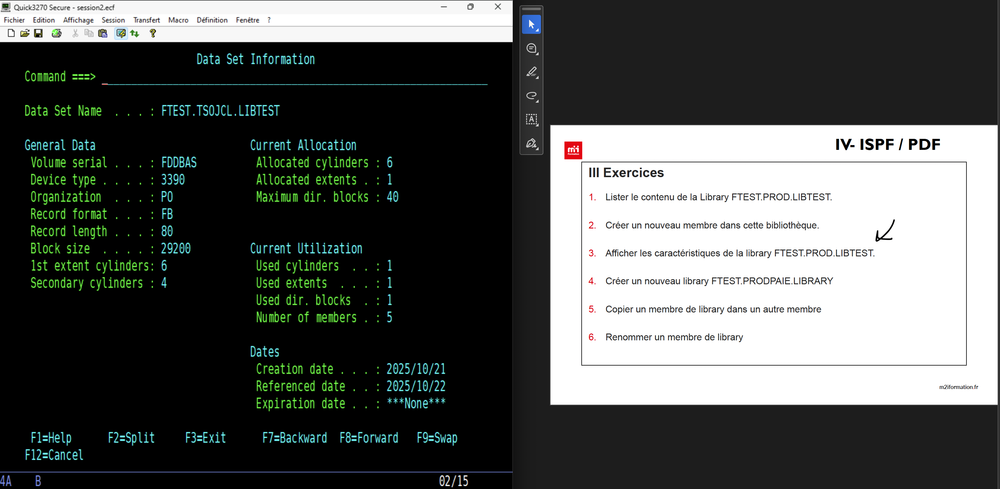
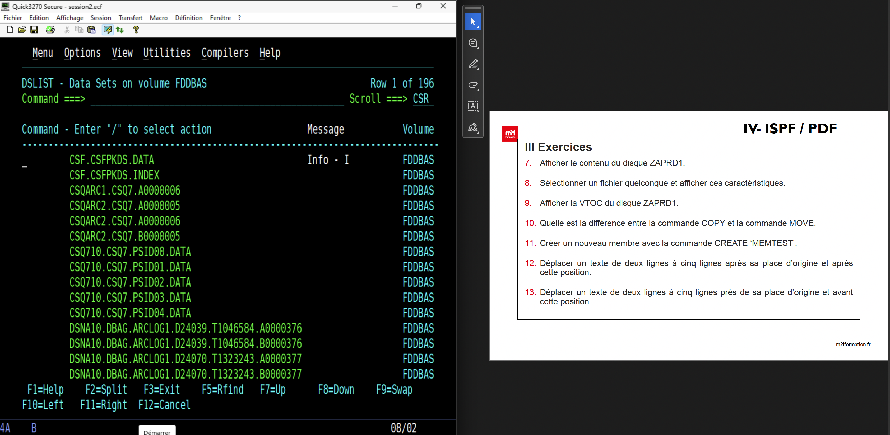
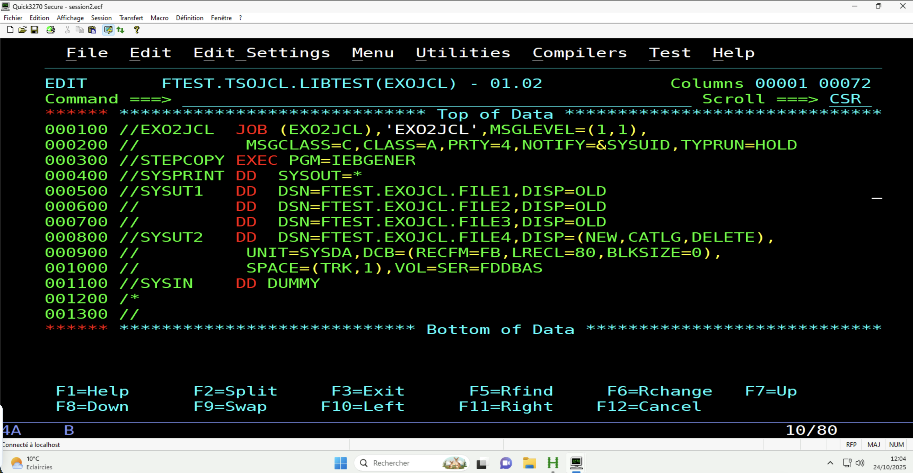
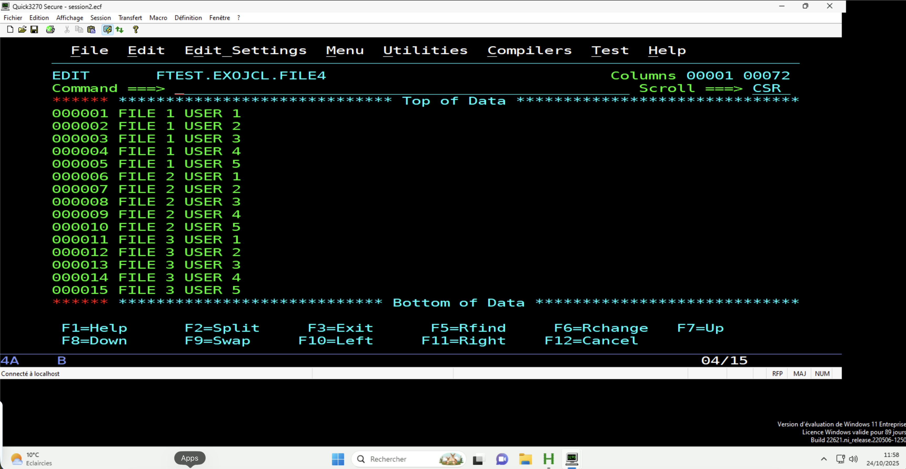

# Formation POEI - COBOL


### Exercices

- En utilisant la commande ALLOC, définir un Data Set FTEST PROD LIBTEST de taille 2 Tracks un DORG PO, taille de l’enregistrement 80 et de format Fixe

```cmd
ALLOC DA('FTEST.PROD.LIBTEST') NEW CATALOG +
    SPACE(2,1) TRACKS +
    DSORG(PO) RECFM(F) LRECL(80) BLKSIZE(800) NEW
```

- Définir un Data Set modèle FTEST DEV MODEL DORG PS, taille de l’enregistrement 80 et de format Fixed Block

```cmd
ALLOC DA('FTEST.DEV.MODEL') NEW CATALOG +
    DSORG(PS) RECFM(FB) LRECL(80) BLKSIZE(800) +
    SPACE(1,1) TRACKS UNIT(SYSDA) NEW
```

- Définir un Data Set FTEST DEV FILE selon le modèle ci dessus

```cmd
ALLOC DA('FTEST.DEV.FILE') NEW CATALOG +
    LIKE('FTEST.DEV.MODEL') +
    UNIT(SYSDA)
```

- Définir un 2 ème portant le nom FTEST PROD FILE

- Définir un 3 ème portant le nom FTEST EXPLOI FILE

## Exercices





### Créer une librairie PDS

- volume : FDDBAS

BNDS : permet d'utiliser FIND

ex : on met bnds dans une colonne puis au niveau de la commande on met 'find toto'
----
`22/10/2025`
----

VTOC : Table du contenu d'un volume (disque).

- SYSPLEX : ensemble de systèmes z/OS interconnectés qui partagent des ressources et des charges de travail pour améliorer la disponibilité et la performance.

- SMS (Storage Management Subsystem) : système de gestion du stockage sur les mainframes IBM qui automatise la gestion des ressources de stockage, optimise l'utilisation de l'espace disque et simplifie l'administration des Data Sets.

- RACF (Resource Access Control Facility) : système de sécurité utilisé sur les systèmes IBM mainframe pour contrôler l'accès aux ressources système, gérer les utilisateurs et les autorisations, et assurer la protection des données sensibles.

- DASD (Direct Access Storage Device) : dispositif de stockage à accès direct utilisé sur les systèmes IBM mainframe pour stocker et récupérer des données de manière efficace. Les DASD incluent des disques durs, des bandes magnétiques et d'autres types de supports de stockage.


----
`24/10/2025`
----

- `EXEC` : instruction JCL qui spécifie le programme à exécuter dans une étape de job.

- `DD (Data Definition)` : instruction JCL qui définit les fichiers et les ressources de données utilisés par un job ou une étape de job dans l'environnement z/OS.

- `DSN (Data Set Name)` : nom attribué à un Data Set (ensemble de données) dans une instruction DD du JCL.

- `DISP (Disposition)` : paramètre dans une instruction DD du JCL qui spécifie le traitement à effectuer sur un Data Set, tel que la création, la suppression ou la mise à jour.

syntaxe du disp : (current-statut, normal-end-status, abnormal-end-status)

- current-statut : indique l'état actuel du Data Set (NEW, OLD, MOD, SHR).
- normal-end-status : action à effectuer si le job se termine normalement (DELETE, KEEP, CATLG, UNCATLG).
- abnormal-end-status : action à effectuer si le job se termine anormalement (DELETE, KEEP, CATLG, UNCATLG).

Chaque STEP aura sa propre instruction DD et dans un STEP on peut utiliser 3273 Data Set.

Dname commence toujours par la colonne 3 et est composé que de maximum 8 caractères

#### Qu’est‑ce que « cataloguer » une librairie ?

Cataloguer un Data Set (ou une librairie PDS/PDSE) signifie l’enregistrer dans le catalogue système de z/OS. Le catalogue fait correspondre le nom logique du dataset (ex. FTEST.PROD.LIBTEST) à son emplacement physique (volumes, unit, extents, etc.), plus certains attributs (DSORG, DCB, …).

#### Pourquoi c’est important

- Résolution par nom : le système et les utilisateurs peuvent ouvrir le dataset simplement par son nom.
- Automatisation : les jobs et scripts n’ont pas besoin de préciser le volume physique.
- Partage/accès multi‑users : le dataset est trouvable et utilisable par d’autres processus.
- Sauvegarde / restauration / recovery : les outils de sauvegarde s’appuient souvent sur le catalogue.
- Gestion et inventaire : administration, quotas, et reporting sont facilités.
- Sécurité et contrôle : plus simple d’appliquer et vérifier des politiques d’accès quand le dataset est catalogué.

#### Conséquences d’un dataset non‑catalogué

- Il faut spécifier explicitement le volume UNIT/VOLSER et les extents pour y accéder.
- Les jobs automatiques risquent d’échouer (impossibilité de résolution par nom).
- Sauvegardes/restaurations et outils d’administration peuvent ignorer ou ne pas retrouver le dataset.
- Risque d’« orphan dataset » : dataset présent sur disque mais non repéré, risquant d’être perdu lors d’opérations de maintenance.

- `DCB (Data Control Block)` : ensemble de paramètres dans une instruction DD du JCL qui définit les caractéristiques d'un Data Set, telles que le format d'enregistrement, la longueur de l'enregistrement et la taille du bloc.

syntaxe DCB : DCB=(RECFM=F,LRECL=80,BLKSIZE=800)

- `UNIT` : paramètre dans une instruction DD du JCL qui spécifie le type de périphérique de stockage (disque, bande, etc.) sur lequel un Data Set doit être alloué ou accédé.

syntaxe de UNIT : (type-de-périphérique, adresse-périphérique, nom du groupe de périphériques)

- `VOLUME` : paramètre dans une instruction DD du JCL qui spécifie le volume physique (disque, bande, etc.) sur lequel un Data Set est stocké ou doit être alloué.

- `SPACE` : paramètre dans une instruction DD du JCL qui définit la quantité d'espace de stockage à allouer pour un Data Set, y compris le type d'unité (cylindres, pistes, blocs) et la taille initiale et supplémentaire.

syntaxe de SPACE : SPACE=(type-unité,(taille-initiale,taille-supplémentaire),allocation-unité)
ex : SPACE=(TRK,(2,1),TRK).

- `KEYLEN` : paramètre dans une instruction DD du JCL qui spécifie la longueur de la clé d'un enregistrement dans un Data Set indexé, utilisé pour l'accès et la recherche des enregistrements.

- `OUTLIM`: paramètre dans une instruction DD du JCL qui définit la limite de sortie pour un Data Set, spécifiant le nombre maximum d'enregistrements ou de blocs qui peuvent être écrits dans le Data Set pendant l'exécution d'un job.

- `SYSOUT` : périphérique de sortie système dans z/OS, généralement utilisé pour diriger la sortie des jobs vers des imprimantes, des fichiers ou d'autres destinations de sortie.

- `SYSIN` : périphérique d'entrée système dans z/OS, utilisé pour fournir des données ou des commandes en entrée à un job ou à une étape de job.

- `DUMMY` : option dans une instruction DD du JCL qui indique que le Data Set n'est pas réellement utilisé ou nécessaire pour l'exécution du job, souvent utilisé pour les tests ou les étapes de job qui ne nécessitent pas de données réelles.

- `SYSUDUMP` : périphérique de vidage système dans z/OS, utilisé pour capturer l'état de la mémoire et des ressources du système en cas de panne ou d'erreur critique, facilitant ainsi le diagnostic et la résolution des problèmes.

#### EXERCICE

- Créer 3 Data Set de structure identique avec des données différentes
- Utiliser le JCL de chargement de PS en utilisant SYSUT1 correspondant aux 3 Data SEt à concatener et SYSUT2 correspondant au Data Set à créer en sortie.

Après avoir créer les 3 fichiers PS vide depuis l'interface (avec alloc et block size 0)
- Script JCL


- Résultat


- `REFERBACK` : paramètre dans une instruction DD du JCL qui indique que le Data Set doit être ouvert en mode de référence arrière, permettant aux programmes d'accéder aux enregistrements dans l'ordre inverse de leur stockage.

# Instructions JCL
## JCL PROCEDURE Statement : PROC

Une procédure JCL (PROC) est un ensemble réutilisable d'instructions JCL qui peut être appelé dans plusieurs jobs ou étapes de job. Elle permet de standardiser et de simplifier la gestion des tâches courantes en encapsulant des séquences d'instructions JCL fréquemment utilisées.

- `STEPLIB` : instruction JCL qui spécifie une liste de bibliothèques (PDS) à utiliser pour rechercher les programmes exécutables dans une étape de job.

- `JCLLIB` : instruction JCL qui spécifie une liste de bibliothèques (PDS) à utiliser pour rechercher les procédures JCL (PROC) dans un job.

## Exercice

1. Définir un Data Set FTEST ESDS AAAA avec un enregistrement de taille 80 caractères qui sera
chargé par les données suivantes

```cmd
111111AAAAAAAAAABBBBBBBBBB 01012020 ADRESSE 1
222222CCCCCCCCCCDDDDDDDDDD 01012021 ADRESSE 2
333333EEEEEEEEEFFFFFFFFFF 01012023 ADRESSE 3
```

2. Utiliser l’utilitaire IEBGENER pour copier ce Data Set dans un nouveau Data Set FTEST ESDS BBBB
3. De même, FTEST ESDS BBBB dans FTEST ESDS CCCC qui sera temporaire dans ce JCL
4. Concaténer les trois Data Set obtenus dans un Data Set FTEST ESDS DDDD

**Résolution**

```jcl
 
//EXO2JCL JOB (EXO2JCL),'EXO2JCL',MSGLEVEL=(1,1),                       
//           MSGCLASS=C,CLASS=A,PRTY=4,NOTIFY=&SYSUID,TYPRUN=HOLD       
//STEP01   EXEC PGM=IEBGENER                                            
//SYSPRINT DD SYSOUT=*                                                  
//SYSUT1   DD DSN=FTEST.ESDS.AAAA,DISP=OLD                              
//SYSUT2   DD DSN=FTEST.ESDS.BBBB,DISP=(NEW,CATLG,DELETE),              
//           UNIT=SYSDA,DCB=(RECFM=FB,LRECL=80,BLKSIZE=0),              
//           SPACE=(TRK,2),VOL=SER=FDDBAS                               
//SYSIN    DD DUMMY                                                     
//STEP02   EXEC PGM=IEBGENER                                            
//SYSPRINT DD SYSOUT=*                                                  
//SYSUT1   DD DSN=FTEST.ESDS.BBBB,DISP=OLD                              
//SYSUT2   DD DSN=&&CCCC,DISP=(NEW,CATLG,DELETE),                       
//           UNIT=SYSDA,DCB=(RECFM=FB,LRECL=80,BLKSIZE=0),              
//           SPACE=(TRK,2),VOL=SER=FDDBAS                               
//SYSIN    DD DUMMY                                                     
//STEP03   EXEC PGM=IEBGENER
//SYSPRINT DD SYSOUT=*                                                  
//SYSUT1   DD DSN=FTEST.ESDS.AAAA,DISP=OLD                              
//         DD DSN=FTEST.ESDS.BBBB,DISP=OLD                              
//         DD DSN=&&CCCC,DISP=OLD                                       
//SYSUT2   DD DSN=FTEST.ESDS.DDDD,DISP=(NEW,CATLG,DELETE),              
//           UNIT=SYSDA,DCB=(RECFM=FB,LRECL=80,BLKSIZE=0),              
//           SPACE=(TRK,2),VOL=SER=FDDBAS                               
//SYSIN    DD DUMMY                                                     
/*                                                                      
//                                                                      
```
---
## Exercice : overlay
---
**Exemple**

```
OUTREC OVERLAY=(65:21,4,ZD,MUL,+12,TO=FS,LENGTH=6)
```

---

### Interprétation

| Élément    | Signification                                                  |
| ---------- | -------------------------------------------------------------- |
| `65:`      | Position de sortie : écrire à partir de la colonne 65          |
| `21,4`     | Lire 4 positions à partir de la colonne 21                     |
| `ZD`       | Format d’entrée = Zoned Decimal (numérique classique en texte) |
| `MUL,+12`  | Multiplier par 12                                              |
| `TO=FS`    | Convertir en format Signed Fixed (type packé signé)            |
| `LENGTH=6` | Longueur du champ de sortie = 6 bytes                          |

---