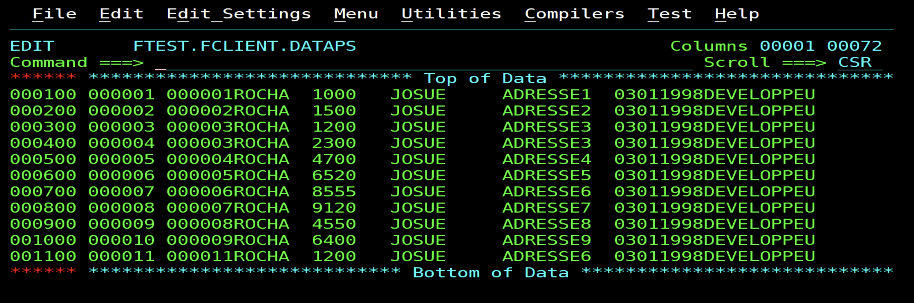
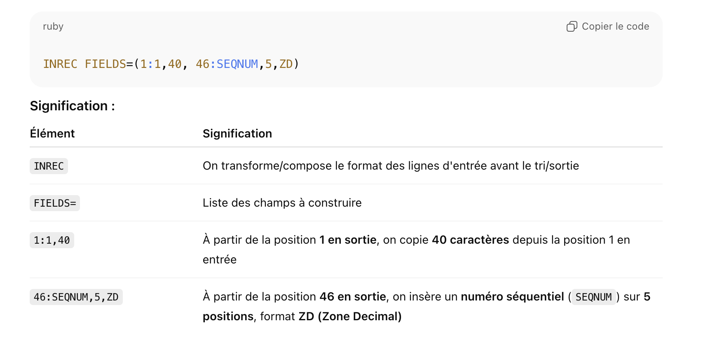
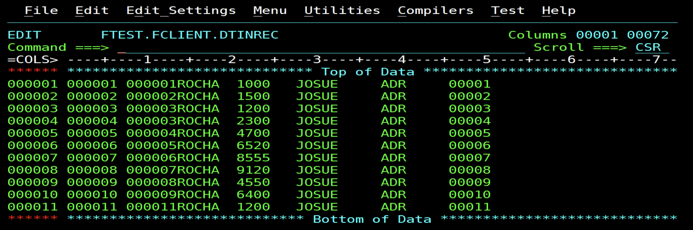
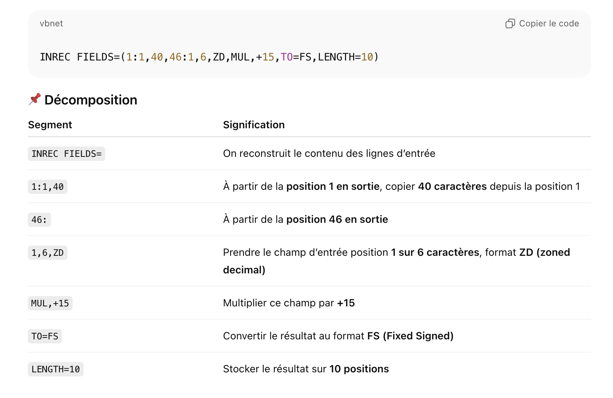
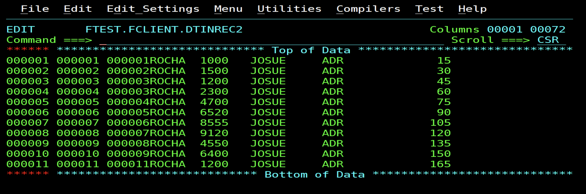

# EXERCICE : SORT AVEC INREC

Elle sert à :

- Sélectionner ou réorganiser des champs

- Ajouter / calculer des valeurs (ex: numéros séquentiels, calculs arithmétiques)

- Convertir des formats (ZD, PD, FS, CH, etc.)

- Insérer des constantes

- Tronquer ou étendre un enregistrement

- Préparer les données avant SORT / MERGE / OUTREC

**Fichier en entré**


## Exercice 1

- code
```jcl
//INRECPS  JOB (INRECPS),'INRECPS',MSGLEVEL=(1,1),              
//         MSGCLASS=C,CLASS=A,PRTY=4,NOTIFY=&SYSUID,TYPRUN=HOLD 
//*===================================================*         
//*        PROGRAMME : INREC DANS UN DATA SET         *         
//*===================================================*         
//STPINREC EXEC PGM=SORT,PARM=MOD                               
//SYSOUT  DD SYSOUT=A                                           
//SORTIN  DD DSN=FTEST.FCLIENT.DATAPS,DISP=SHR                  
//SORTOUT DD DSN=FTEST.FCLIENT.DTINREC,                         
//        DISP=(NEW,CATLG,DELETE),UNIT=3390,VOL=SER=FDDBAS,     
//        DCB=(RECFM=FB,LRECL=80,BLKSIZE=800),SPACE=(TRK,40)    
//SYSIN   DD DATA                                               
    SORT FIELDS=(1,6,ZD,A)                                      
    INREC FIELDS=(1:1,40,46:SEQNUM,5,ZD)                        
/*                                                              
//                                                              
````
- Explication



- Fichier en sortie


## Exercice 2

- code 

```jcl
//INRECPS  JOB (INRECPS),'INRECPS',MSGLEVEL=(1,1),               
//         MSGCLASS=C,CLASS=A,PRTY=4,NOTIFY=&SYSUID,TYPRUN=HOLD  
//*===================================================*          
//*        PROGRAMME : INREC DANS UN DATA SET         *          
//*===================================================*          
//STPINREC EXEC PGM=SORT,PARM=MOD                                
//SYSOUT  DD SYSOUT=A                                            
//SORTIN  DD DSN=FTEST.FCLIENT.DATAPS,DISP=SHR                   
//SORTOUT DD DSN=FTEST.FCLIENT.DTINREC2,                         
//        DISP=(NEW,CATLG,DELETE),UNIT=3390,VOL=SER=FDDBAS,      
//        DCB=(RECFM=FB,LRECL=80,BLKSIZE=800),SPACE=(TRK,40)     
//SYSIN   DD DATA                                                
    SORT FIELDS=(1,6,ZD,A)                                       
    INREC FIELDS=(1:1,40,46:1,6,ZD,MUL,+15,TO=FS,LENGTH=10)                       
/*                                                              
//                                                              
````

- Explication


- fichier en sortie

