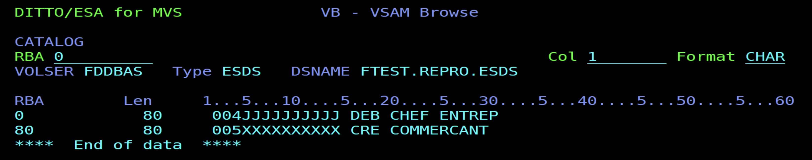

# Exercices VSAM
---

## EXERCICE 1
### **1️⃣ Quelle est l’expression complète de l’acronyme VSAM ?**

> **VSAM = Virtual Storage Access Method**
> C’est une méthode d’accès aux fichiers utilisée sur les systèmes IBM Mainframe, plus performante que les fichiers séquentiels classiques.

---

### **2️⃣ Que signifie un Data Set ?**

> Un **Data Set** est un **fichier** sur le système IBM z/OS.
> C’est l’unité de base de stockage des données sur un disque (ou bande).
> 👉 En d’autres mots, un *Data Set* = un fichier contenant un ensemble d’enregistrements.

---

### **3️⃣ Quel est le rôle de la VTOC pour un disque ?**

> **VTOC = Volume Table Of Contents**
> C’est la **table des matières du disque** :
> elle contient la **liste de tous les Data Sets** présents sur le volume, avec leurs **emplacements physiques** (cylindres, pistes, etc.) et leurs **attributs**.

---

### **4️⃣ Quelle est la taille d’un disque composé de 10017 Cylindres, chaque Cylindre ayant 15 tracks de 56664 octets ?**

🧮 Calcul :

```
Taille = 10017 cylindres × 15 pistes × 56 664 octets
Taille = 8 500 986 280 octets
```

➡️ Environ **8,5 Go**

---

### **5️⃣ Quels sont les différents types d’organisation de fichiers ?**

> Les principales **organisations de fichiers** sont :

1. **Séquentielle (PS)** — enregistrements à la suite.
2. **Indexée (KSDS)** — accès par clé, avec index.
3. **Relative (RRDS)** — accès par numéro relatif.
4. **Entrée séquentielle (ESDS)** — selon l’ordre d’entrée.
5. **Linéaire (LDS)** — données binaires, sans structure.

---

### **6️⃣ Quel est le support des fichiers VSAM ?**

> Les fichiers VSAM sont **stockés sur disque (DASD – Direct Access Storage Device)**.
> 👉 Ils ne peuvent **pas être sur bande magnétique**, car ils nécessitent un accès direct rapide.

---

### **7️⃣ Quels sont les types de Data Set ?**

> Il existe deux grandes familles :

1. **Non-VSAM :**

   * PS (*Physical Sequential*)
   * PDS / PDSE (*Partitioned Data Set*)

2. **VSAM :**

   * KSDS (*Key Sequenced Data Set*)
   * ESDS (*Entry Sequenced Data Set*)
   * RRDS (*Relative Record Data Set*)
   * LDS (*Linear Data Set*)

---

### **8️⃣ Quelles sont les manières d’accès au Data Set ?**

> Trois types d’accès :

1. **Séquentiel** — lecture des enregistrements dans l’ordre.
2. **Direct (aléatoire)** — lecture par clé ou position.
3. **Dynamique** — combinaison des deux (on peut alterner).

---

### **9️⃣ Que peut-on stocker dans un PDS ?**

> Un **PDS (Partitioned Data Set)** contient des **membres**, un peu comme des fichiers dans un dossier.
> On peut y stocker :

* des **programmes source** (COBOL, JCL, ASM, etc.),
* des **macros**,
* des **scripts de procédures (PROCs)**,
* ou tout autre type de texte structuré.

👉 Chaque membre est accessible individuellement (ex. `MONPDS(MONJCL)`).

---

# EXERCICE 2
---

### 1️⃣ Quelle est l’utilité d’un catalogue

Le **catalogue** sert à **répertorier et localiser les datasets** (fichiers) du système.
Il contient les **informations de nom, type, volume et emplacement** de chaque fichier, ce qui permet d’y accéder sans connaître le volume physique où il est stocké.

---

### 2️⃣ Combien existe-t-il de types de catalogue

Il existe **deux types principaux de catalogues** :

* **Master Catalog** → le catalogue principal du système.
* **User Catalog(s)** → catalogues secondaires reliés au Master Catalog pour organiser les datasets des utilisateurs ou applications.

---

### 3️⃣ Peut-on avoir plusieurs Catalogue Master dans un système Z/OS

❌ **Non.**
Il n’existe **qu’un seul Master Catalog** par système z/OS.
C’est le point d’entrée unique pour tous les catalogues utilisateurs.

---

### 4️⃣ Peut-on avoir plusieurs volumes pour un catalogue

✅ **Oui.**
Un catalogue peut être **étendu sur plusieurs volumes** si sa taille dépasse la capacité d’un seul.

---

### 5️⃣ À quoi sert l’espace des données défini au niveau de la commande USERCATALOG

L’**espace de données** sert à **stocker les informations de structure du catalogue utilisateur**, notamment :

* les **enregistrements VSAM** du catalogue (INDEX, DATA),
* les **entrées de datasets catalogués**.

---

### 6️⃣ Peut-on définir des objets VSAM dans cet espace ?

✅ **Oui.**
Le **catalogue lui-même** est un **fichier VSAM de type KSDS** (Key Sequenced Data Set).
Donc, on y définit **des objets VSAM internes**, utilisés pour la gestion du catalogue.

---

### 7️⃣ Que peuvent être les objets non VSAM dans un catalogue

Les objets **non VSAM** catalogués peuvent être :

* des **datasets séquentiels (PS)**,
* des **Partitioned Data Sets (PDS ou PDSE)**,
* ou encore des **fichiers temporaires** référencés par nom.

---

### 8️⃣ Quelle est la différence entre un enregistrement logique et un enregistrement physique

* **Enregistrement logique (Logical Record)** → unité de données manipulée par le programme (ex. : un client, une transaction).
* **Enregistrement physique (Physical Record)** → unité de stockage sur disque.

  > Plusieurs enregistrements logiques peuvent être regroupés dans un même enregistrement physique pour des raisons de performance (blocking).

---





