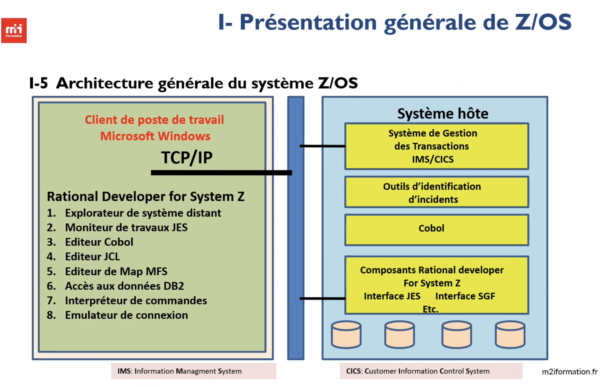
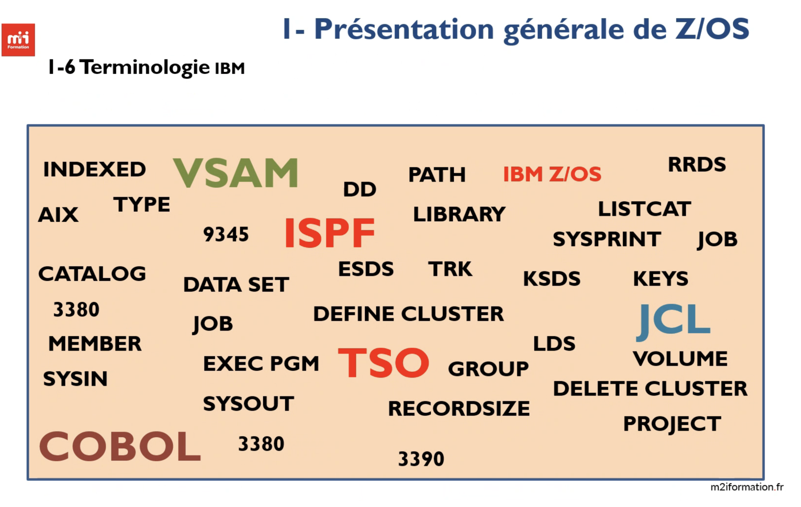
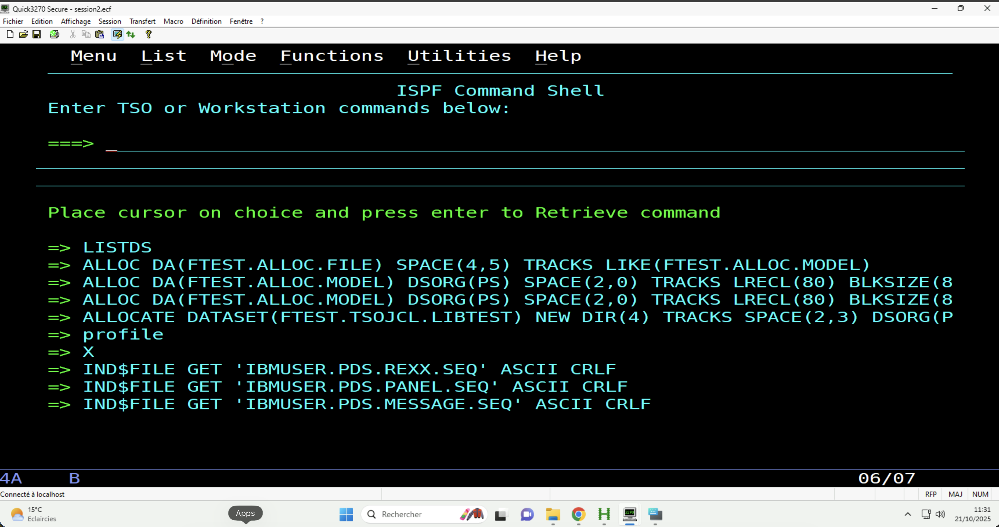

# Cours z/OS et COBOL – Formation POEI
---

## 🧠 1. Introduction à COBOL et aux systèmes IBM

### 💬 COBOL, c’est quoi ?

Langage **orienté gestion**, utilisé pour le traitement des données dans les domaines **banque, assurance, administration**.
→ Toujours très utilisé sur les **mainframes IBM**, car **stable, fiable et performant**.

### 💼 Pourquoi devenir développeur COBOL ?

* Langage **indispensable** dans les grandes entreprises.
* **Compétences rares**, donc forte **employabilité**.
* Opportunité d’intégrer des **secteurs critiques** (finance, État, etc.).

---

## 🏢 2. Histoire et rôle de Bull

* **Bull** : groupe informatique français fondé en 1931, intégré ensuite à **Atos**.
* Fabricant de **mainframes** et systèmes d’exploitation.
* Lien avec COBOL : beaucoup d’applications COBOL tournaient sur **machines Bull** ou IBM.

---

## ⚙️ 3. Concepts de base

| Terme              | Définition                                              |
| ------------------ | ------------------------------------------------------- |
| **Batch**          | Traitement en arrière-plan sans interaction utilisateur |
| **Transactionnel** | Interaction en temps réel avec l’utilisateur            |
| **SGBD**           | Gère les **bases de données** relationnelles (ex : Db2) |
| **SGF**            | Gère les **fichiers** (ex : VSAM)                       |

---

## 💾 4. Modules et composants IBM

| Module   | Description                                                              |
| -------- | ------------------------------------------------------------------------ |
| **JCL**  | Langage de script pour exécuter des jobs (tâches batch) sur z/OS         |
| **ISPF** | Interface interactive pour édition, gestion de fichiers et développement |
| **VSAM** | Méthode d’accès aux fichiers (KSDS, ESDS, RRDS)                          |
| **CICS** | Gestionnaire de transactions en ligne                                    |
| **Db2**  | Base de données **relationnelle** IBM                                    |
| **IMS**  | Base de données **hiérarchique** et système transactionnel               |

**Db2 vs IMS :**
→ Db2 = modèle relationnel (tables)
→ IMS = modèle hiérarchique (parent/enfant)

---

## 🧩 5. Environnements IBM

| Environnement | Description                                      |
| ------------- | ------------------------------------------------ |
| **MVS**       | Ancien système multitâche/multiprogrammé         |
| **z/OS**      | Système d’exploitation moderne, sécurisé, fiable |
| **VSE**       | Version allégée pour PME                         |

### Atouts des mainframes :

* Fiabilité extrême
* Gestion massive de transactions
* Sécurité des données

---

## 🏗️ 6. Architecture z/OS

* **DASD** : disques à accès direct (stockage).
* **Data Set** : fichier ou ensemble de données.
* **Enregistrement** : ligne ou entrée dans un Data Set.
* **Cluster (VSAM)** : ensemble de Data Sets structurés.
* **AIX (Alternate Index)** : clé secondaire pour un accès plus rapide.





**Fonctionnement de Z/OS**

- Z/OS est un système d'exploitation pour les mainframes IBM, conçu pour gérer de grandes quantités de données et de transactions de manière fiable et sécurisée. 
- Il offre des fonctionnalités avancées pour la gestion des ressources, la sécurité des données et le support des applications critiques.

**Caractéristiques de MVS (Multiple Virtual Storage) :**

- Multi-tâches : permet l'exécution simultanée de plusieurs tâches.
- Multi-programmation : gère plusieurs programmes en mémoire.
- Multi-processeur : supporte l'utilisation de plusieurs processeurs.
- Gestion de la mémoire virtuelle : optimise l'utilisation de la mémoire.
- Sécurité avancée : protège les données et les ressources du système.

**Différnces entre la mémoire CPC et auxiliaire :**

- Mémoire CPC (Central Processor Complex) : mémoire principale utilisée par le processeur pour exécuter les programmes et stocker les données en cours d'utilisation.
- Mémoire auxiliaire : mémoire secondaire utilisée pour le stockage à long terme des données et des programmes, généralement plus lente que la mémoire CPC.

---

## 💻 7. Environnements d’accès et d’interaction

### 🔹 TSO (Time Sharing Option)

Interface **en ligne de commande** pour interagir avec z/OS.
Permet de créer, exécuter et gérer des fichiers et programmes.

**Principales commandes :**
`HELP`, `PROFILE`, `SEND`, `ALLOCATE` (création de Data Set).

- TSO HELP : affiche l'aide générale de TSO.
- PROFILE : affiche ou modifie les paramètres de profil utilisateur.
- SEND : envoie un message à un autre utilisateur TSO.
- ALLOCATE : alloue des ressources, telles que des fichiers ou des espaces de stockage (PS : principalement un fichier de données et PDS: l'équivalent d'un répertoire).
- 

- **Exemples de création de Data Set**

```cmd
ALLOC DA('FTEST.DEV.MODEL') NEW CATALOG +
 DSORG(PS) RECFM(FB) LRECL(80) BLKSIZE(800) +
 SPACE(1,1) TRACKS UNIT(SYSDA)
```



---

### 🔹 ISPF (Interactive System Productivity Facility)

Interface **plein écran** pour :

* Éditer du code COBOL,
* Gérer des librairies PDS,
* Visualiser des Data Sets.

Un **PDS** = dossier contenant plusieurs **membres** (fichiers COBOL, JCL…).

---

## 📂 8. Gestion du stockage et de la sécurité

| Outil       | Rôle                                           |
| ----------- | ---------------------------------------------- |
| **VTOC**    | Table du contenu du volume (disque)            |
| **SYSPLEX** | Groupe de systèmes z/OS interconnectés         |
| **SMS**     | Automatisation de la gestion du stockage       |
| **RACF**    | Contrôle des accès et gestion des utilisateurs |
| **DASD**    | Disque principal de stockage                   |

---
f
## 🧾 9. Le JCL (Job Control Language)

### Objectif :

Décrire au système **quoi exécuter**, **avec quelles ressources**.

### 3 instructions principales :

1. **JOB** → début du travail
2. **EXEC** → indique le programme à exécuter
3. **DD** → définit les fichiers utilisés

### JES2 / JES3

* **JES2** : gère la soumission et le suivi des jobs.
* **JES3** : plus avancé, gère les ressources réparties.

### Paramètres importants :

* **DISP** : statut du fichier (NEW, OLD, MOD, SHR) et action après exécution.
* **DCB** : caractéristiques du fichier (format, taille, bloc).
* **UNIT / VOLUME / SPACE** : paramètres physiques du stockage.
* **SYSIN / SYSOUT** : entrées et sorties du système.
* **DUMMY** : fichier fictif pour tests.
* **SYSUDUMP** : capture mémoire en cas d’erreur.

### Cataloguer un Data Set :

→ Permet de l’enregistrer dans le **catalogue système**, donc accessible par nom sans préciser son emplacement physique.

---

## 🔁 10. JCL – Concepts avancés

* **PROC (PROCÉDURE)** : ensemble JCL réutilisable (comme une fonction).
* **JCLLIB** : indique où chercher les procédures.
* **STEPLIB** : indique où chercher les programmes exécutables.

---

## 🧮 11. Commandes et exercices pratiques

* Création de Data Sets (PS, PO, modèles).
* Exécution de jobs batch.
* Concatenation de fichiers PS via JCL.
* Utilisation de **Quick3270** (console) :

  * `ipl 0a80` → démarrer la machine
  * `r 04, cancel` → répondre à une erreur
  * `s shutdown` → arrêter la session
  * `v net,act,id=LCL701`: ACTIVER L'ÉCRAN
  * `LOGON IBMUSER` → se connecter

---

## 🧩 12. En résumé

| Élément                  | Fonction principale                         |
| ------------------------ | ------------------------------------------- |
| **COBOL**                | Langage de gestion orienté données          |
| **z/OS**                 | Système d’exploitation mainframe            |
| **TSO / ISPF**           | Interfaces utilisateur                      |
| **JCL**                  | Langage de contrôle de jobs                 |
| **VSAM / Db2 / IMS**     | Gestion des données                         |
| **RACF / SMS / SYSPLEX** | Sécurité et administration                  |
| **Bull**                 | Ancien acteur majeur des systèmes mainframe |

---
## Les procédures JCL

- `PROC (Procédure)` : ensemble d'instructions JCL réutilisables, permettant de standardiser et simplifier la création de jobs en encapsulant des séquences courantes.

`Procédure In-Stream` est une procédure écrite à l'intérieur d'un job JCL, tandis qu'une `Procédure Cataloguée` est stockée dans une bibliothèque JCL et peut être réutilisée par plusieurs jobs.

- `JOBLIB` : réservé pour l'éxécution de programmes.
- `STEPLIB`: réservé pour l'éxécution de programmes au sein d'une étape de job spécifique.
- `JCLLIB`: réservé pour l'éxécution de procédures JCL (on le définit avec max 80 caractères).

**Syntaxe** : 

- JOBLIB :
```JCL
//JOBLIB DD DSN=nom-de-la-bibliothèque,DISP=SHR
```
- STEPLIB :
```JCL
//STEPLIB DD DSN=nom-de-la-bibliothèque,DISP=SHR
``` 
- JCLLIB :
```JCL
//JCLLIB ORDER=(nom-de-la-bibliothèque1,nom-de-la-bibliothèque2)
``` 
## Les utilitaires système JCL

- `IEFBR14` : utilisé pour allouer ou libérer des Data Sets sans effectuer de traitement supplémentaire. Souvent utilisé pour créer des Data Sets vides ou pour libérer des ressources.

- `IEBCOMPR` : utilisé pour comparer le contenu de deux Data Sets. Il génère un rapport indiquant les différences entre les fichiers comparés.

- `IEBCOPY` : utilisé pour copier des Data Sets d'une source à une destination. Il prend en charge divers formats de fichiers et options de copie.

- `IEBGENER` : utilisé pour copier des données d'un Data Set source vers un Data Set de destination. Il est souvent utilisé pour des opérations simples de copie de fichiers.

- `IDCAMS` : utilisé pour gérer les fichiers VSAM (Virtual Storage Access Method). Il permet de créer, modifier, supprimer et gérer les clusters VSAM.

- `SORT` : utilisé pour trier, fusionner et filtrer les enregistrements dans un Data Set. Il offre des fonctionnalités avancées pour manipuler les données.
Sort est important car il permet d'organiser selon le critère de traitement les données de manière efficace, facilitant ainsi l'analyse et le traitement ultérieur.

---

## VSAM (Virtual Storage Access Method)

- Un fichier VSAM est une méthode de stockage de données utilisée dans les systèmes mainframe IBM. Il permet un accès efficace aux enregistrements de données.

- La notion de VSAM concerne le stockage des données et la méthode d’accès à ces
données.

---

## Notions sur l'AIX


